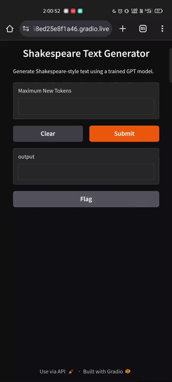

# Using Gradio
Gradio is an open-source Python library that lets you create user-friendly web interfaces for machine learning models with minimal code. It's great for building interactive demos and sharing them easily.

- Deploying a model using Gradio is straightforward.
    - Create a Gradio Interface: Define your model and create a Gradio interface.

    - Launch the Interface: Launch the Gradio interface to create a web app.

## Deployment Demo:

- Deployed over Gradio and accessible through our smartphone.

# On Edge Using AiHub Qualcomm
Qualcomm AI Hub is a platform designed to optimize, validate, and deploy machine learning models on Qualcomm devices. It supports models from frameworks like PyTorch and ONNX, and provides tools for on-device profiling and inference.
 
Qualcomm® AI Hub automatically handles model translation from source framework to device runtime, applying hardware-aware optimizations, and performs physical performance/numerical validation. 

To use Qualcomm® AI Hub, you require:
- A trained model which can be in PyTorch, TorchScript, ONNX or TensorFlow Lite format.

The following three steps can be used to deploy trained models to Qualcomm® devices:

- Step 1: Optimize for on-device execution
    - The system contains a collection of hosted compiler tools that can optimize a trained model for the chosen target platform. Hardware-aware optimizations are then performed to ensure the target hardware is best utilized. The models can be optimized for deployment on either Qualcomm® AI Engine Direct, TensorFlow Lite, or ONNX Runtime. All format conversions are automatically handled.

- Step 2: Perform on-device inference
    - The system can run the compiled model on a physical device to gather metrics such as the mapping of model layers to compute units, inference latency, and peak memory usage. The tools can also run the model using your input data in order to validate numerical correctness. All analyses are performed on real hardware automatically provisioned in the cloud.

- Step 3: Deploy
    - Model results are displayed on Qualcomm® AI Hub, providing insights to understand the model performance and opportunities for further improvements. The optimized model is available for deployment to a variety of platforms.

## Deployment Demo:

- Encountered error: 
    - ShapeInferenceError
    - unsupported type: tensor(float)

# [Approach Page->](index.md)
## [<- Finetuning the Model](finetuning.md)