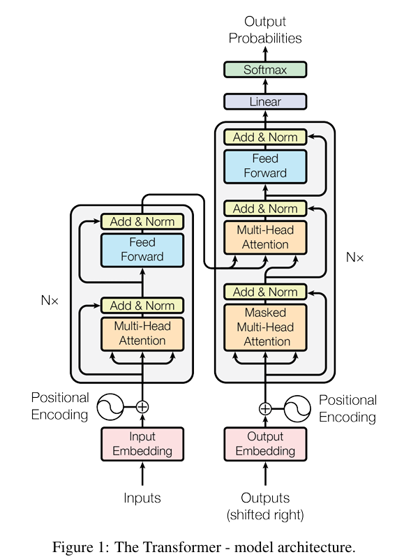

# Introdunction
Transformer based language model (character level language model)

- Dataset [Tiny Shakespeare](https://www.kaggle.com/datasets/kaushaltiwari/tiny-shakespeare?select=tiny-shakespeare.txt)

## Model Architecture

Referece: [Attention Is All You Need](https://arxiv.org/pdf/1706.03762)

## Papers On GPT
- Attention is All You Need [arxiv.org](https://arxiv.org/pdf/1706.03762)