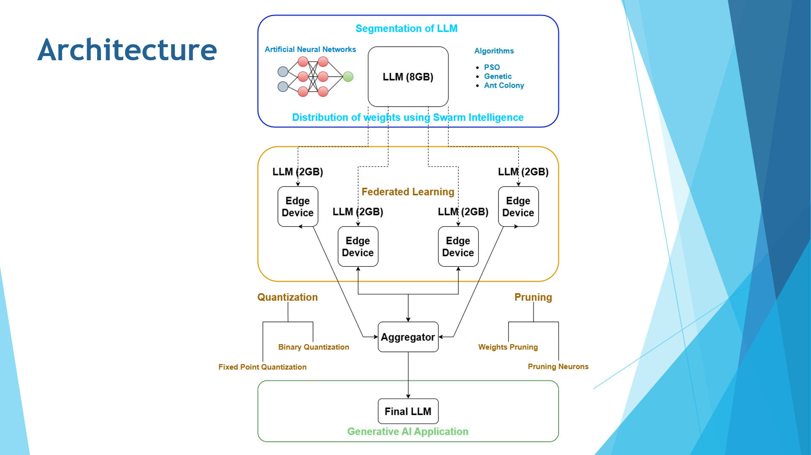

# Gen AI on Edge Devices EdgeBee-Swarm Intelligence

## Workflow Architecture

1. Started with PSO implementation for weights extraction. But failed to implement it.
    - [PSO Implementation](./pso.md) Doc.

2. Following Bottom Up approach, started with working on Quantiation of models and LLMs.
    - Quantized HuggingFace models using Quanto Library.
    - Implemented 8-bit Modality Agnostic Quantizer.
    - Read [Quantization](./Quantization.md) Doc for more.

3. Implemented characterwise GPT model to understand the GPT structure.
    - Read [GPT Implementation](./gpt.md) Doc for more.
    - Qunatized the Implemented GPT model.

4. Working on Finetuning the LLMs.
    - [Fine-tuning](./finetuning.md) Documentation.

## Future work
- Learn and implement Federated learning.
- Try implementing 2-Bit Quantizer for Edge Devices.
- Quantize and Finetune Llama Model.

